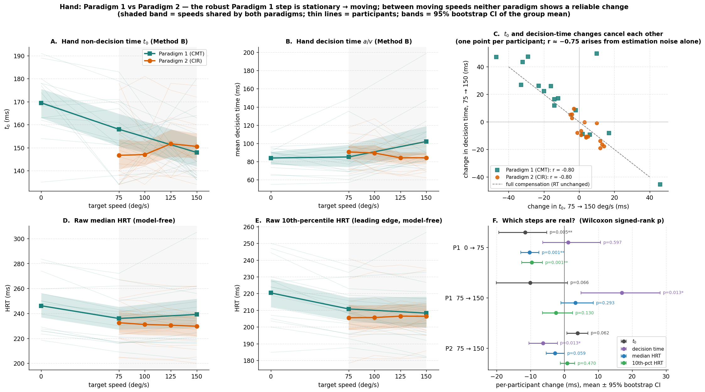
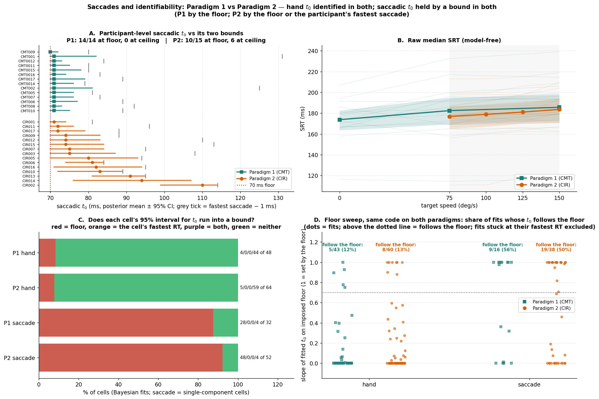
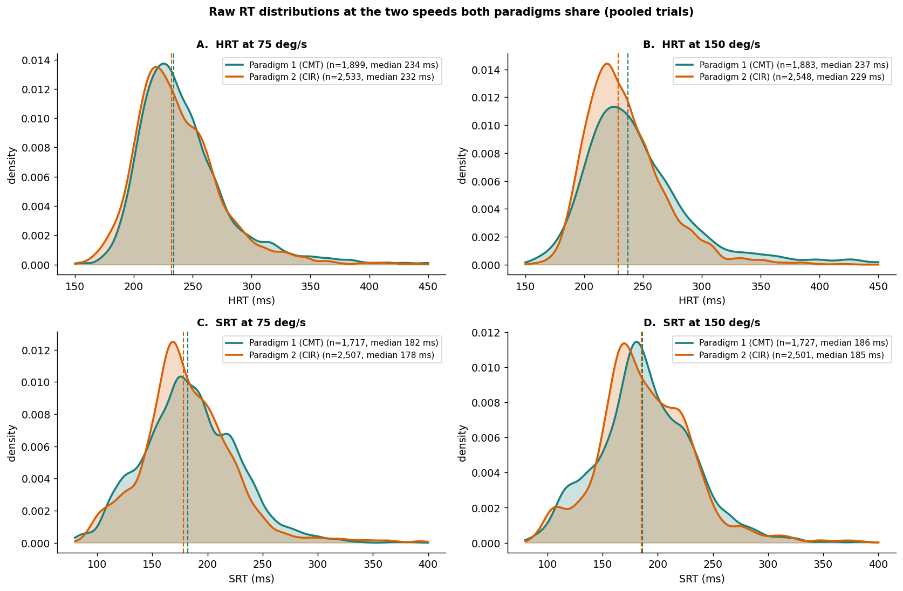

# Paradigm 2 (CIR) — Results, Takeaways, and Comparison to Paradigm 1

**Rishvanth Amsaraj · 2026-09-24, revised 2026-10-03 · companion to `P2_Technical_Breakdown.md`**

This document synthesizes the Paradigm 2 analysis for the lab: what was found, what it means, what still needs answering, and how it lines up against Paradigm 1. Every number is drawn from the computed tables — Paradigm 2 from `Code/`, the cross-paradigm numbers from `Code/Comparison/P1_vs_P2_summary.csv` (built by `P1_vs_P2_comparison.py` from both paradigms' committed tables and raw trials). The revision corrects several statements in the first version; the list is in `VERIFICATION_REPORT_P2.md`.

---

## 1. What Paradigm 2 is

| | Paradigm 1 (CMT) | Paradigm 2 (CIR) |
|---|---|---|
| Participants | 16 (CMT001–CMT010, CMT0011, CMT0012, CMT0014–CMT0017; no CMT0013) | 16 (CIR001–CIR017, no CIR004) |
| Speeds | 0 / 75 / 150 deg/s (includes a stationary target) | 75 / 100 / 125 / 150 deg/s (all moving) |
| Design | 3 speeds interleaved in every block | 4 speeds interleaved in every block |
| Block type analysed | `I` (interception) | `P2` |
| Interception trials | 5,760 (the file's 7,676 rows also hold 1,916 saccade-only `S` trials, not analysed) | 10,239 |
| Kept after the RT windows | 5,690 hand / 5,164 saccade (~120 trials per cell) | 10,158 hand / 10,017 saccade (~160 per cell) |
| Model | single-boundary shifted Wald | same, unchanged |

The pipeline is the single-boundary shifted Wald that Paradigm 1 settled on (Method A = MLE with 5% contamination; Method B = hierarchical Bayesian via NUTS). Only configuration changed: speeds, block type, input file, and four-speed figure layout. Likelihood, priors, bounds, floors (hand 130 / saccade 70 ms), RT windows (150–800 / 80–600 ms), optimiser and sampler settings are byte-identical. Every Paradigm 1 figure has a Paradigm 2 counterpart (one per speed where Paradigm 1 had one per speed).

---

## 2. Headline results

1. **The pipeline ports cleanly.** Paradigm 2 ran with no methodological changes.
2. **The code and environment are verified.** Re-running the original Paradigm 1 scripts on Paradigm 1 data reproduces Method A exactly (48/48 hand and 48/48 saccade cells, identical model choices) and Method B to Monte Carlo error (hand t₀ r = 0.9995, largest cell difference 1 ms). A clean rerun from the repo reproduces every Paradigm 2 table.
3. **Hand t₀ is identified, as in Paradigm 1.** 0 divergences, max R-hat 1.003, 0/64 Bayesian cells at the floor; the floor sweep shows the hand is set by the data, not the bound (median slope 0.00 in both paradigms, same code).
4. **Between moving speeds, hand t₀ does not change reliably — in either paradigm.** Paradigm 2's hand t₀ is flat (≈147–152 ms; +3.9 ms from 75 to 150). Paradigm 1's −10.1 ms over the same 75 → 150 range was not reliable either (p = 0.066), and raw RTs are flat in both. **Paradigm 1's robust speed effect is the stationary → moving step** (t₀ −11.5 ms, p = 0.005; raw median HRT −10.2 ms, p < 0.001) — a condition Paradigm 2 does not have. This is the central finding, and it reframes rather than overturns Paradigm 1.
5. **Saccadic t₀ is still not identifiable — but for a new reason.** In Paradigm 1 every participant's estimate hit the 70 ms floor. In Paradigm 2, 10/15 hit the floor and 6/15 hit the ceiling (the participant's fastest saccade − 1 ms; 2 hit both). Reporting saccadic t₀ as fixed at 70 ms remains the defensible choice.
6. **Left vs Right changes where the hand goes, not when it starts.** Right targets draw a ~13° larger lead, but there is no reliable difference in reaction time or any decision parameter.
7. **The extraction's QA flags don't matter.** Excluding the 48 flagged saccades moves saccadic t₀ by ≤ 1.6 ms and flips the model in 1/25 affected cells (a borderline one).

---

## 3. Results in detail

### 3.1 Hand non-decision time

| Speed | Method B t₀ (mean [95% CI]) | Method A t₀ (mean ± SD) |
|---|---|---|
| 75 | 146.7 [138.8, 154.8] | 148.1 ± 21.6 |
| 100 | 147.0 [138.7, 155.4] | 146.4 ± 14.4 |
| 125 | 151.7 [142.1, 160.7] | 156.5 ± 17.7 |
| 150 | 150.6 [141.0, 159.9] | 146.5 ± 15.9 |

Hand t₀ is essentially flat: +3.9 ms from 75 to 150 deg/s [0.8, 6.9], and the per-participant trend is not reliable (slope +1.63 ms per 25 deg/s, p = 0.074). Method A — the noisier estimator — shows nothing at all (Friedman p = 0.398). The Method B Friedman test is significant (p = 0.026), but it is picking up a ~4–5 ms step between 100 and 125 deg/s, not a trend.

The small t₀ change is offset by decision time: the mean decision time a/v *falls* by 6.3 ms from 75 to 150 [−10.4, −2.1], and across participants the two changes correlate at r = −0.80. The raw median HRT therefore barely moves (−2.8 ms, p = 0.059), and the leading edge (10th-percentile HRT) does not move at all (+0.8 ms, p = 0.47). The recovery test (§4) shows that this coupling appears from estimation noise alone, so neither the t₀ change nor the decision-time change should be read as real on its own.

Method A floors 19/64 cells; the recovery study explains this as estimation noise (true values sit only ~17–22 ms above the 130 ms floor, and per-cell RMSE is 12–14 ms). Partial pooling (Method B) removes it.

### 3.2 Saccadic non-decision time

Saccadic t₀ remains fixed at 70 ms. The participant-level model produces posterior means of 71–110 ms, but only CIR014 (94 ms [76, 107]) is clear of both the 70 ms floor and the fastest-saccade ceiling; the rest press against one bound or the other. Per cell, the Bayesian per-speed fits put 48 of 52 saccade intervals on the floor and none against the fastest saccade. The ceiling only binds in the participant-level model, because there a single t₀ must sit below the participant's fastest saccade across all four speeds — a lower ceiling than any one cell's.

The shape mechanism that diagnosed Paradigm 1 still holds: pooled saccade skew/CV 3.9 implies t₀ ≈ 44 ms (below the floor); hand skew/CV 12.9 implies ≈ 181 ms (above the floor).

**Express saccades.** Six two-component cells have a genuinely express fast component (< 130 ms): CIR008 at every speed (~105 ms) and CIR007 at two (~125 ms). CIR015's "fast" component (~181 ms) and CIR003's closely spaced components are two-component fits, not express saccades. CIR001 is the least well-described participant (single-Wald KS 0.110–0.158 at every speed).

**Saccades get slower as the target gets faster** — model-free, and in both paradigms: median SRT +6.8 ms from 75 to 150 in Paradigm 2 (p < 0.001), +3.2 ms in Paradigm 1 (p = 0.011).

### 3.3 Left vs Right and aiming

| Measure (Right − Left, pooled) | Value | p |
|---|---|---|
| Median HRT | +4.79 ms | 0.453 |
| Median SRT | +3.40 ms | 0.860 |
| Method A hand t₀ | +0.16 ms | 0.597 |
| Signed error (`SignedError_deg`) | +13.19° | 0.004 |
| Signed error (HRT50) | +10.00° | < 0.001 |

**Movement start does not differ by direction** — HRT, SRT, t₀, and boundary separation are all indistinguishable across Left and Right (one drift difference at 100 deg/s is 1 of 20 tests and does not recur). **Aim does differ** — the hand leads the target on 91–95% of Left trials but 98–99% of Right trials, with a ~13° larger lead for Right targets.

This matters for the motor-plan-vs-biomechanics question: whatever produces the Left/Right launch-angle asymmetry acts on the content or execution of the movement, not on when it starts. The RT data cannot separate plan content from biomechanics — the planned submovement/kinematic analysis is the right tool.

---

## 4. Validation

**Paradigm 1 parity** (original Paradigm 1 scripts rerun in this environment on Paradigm 1 data):

| Table | Match |
|---|---|
| `DDM_hrt_fits.csv` | 48/48 cells, exact (0.0 difference on every stored column) |
| `DDM_srt_fits.csv` | 48/48 cells, exact; model choice 48/48 identical |
| `Bayesian_hrt_fits.csv` | 48/48 cells, t₀ within 1 ms, r = 0.9995 (Monte Carlo error) |

**Reproducibility within Paradigm 2.** A second full run of `Bayesian_SRT_ndt.py` reproduced its tables byte-for-byte; a clean `run_all_P2.py --skip-bayes-fits` from the repo regenerates every Method A, diagnostic, and supplementary table identically (details in `VERIFICATION_REPORT_P2.md`).

**Bayesian recovery** (`Validation/bayesian_recovery_P2.py`; one simulated dataset with Paradigm 2's participants, speeds and cell sizes, true hand t₀ falling 10 ms from 75 to 150 deg/s, v and a fixed): the production model **detects** the change (15/16 participants, p = 0.003) but **shrinks** it to −5.9 ms [−8.2, −3.4] and moves −4.3 ms into decision time (truth 0, p = 0.013). The two estimated changes correlate at r = −0.75 although nothing varies between participants. Absolute hand t₀ comes out about 6 ms high, and per-cell 95% intervals contain the truth in only 70% of cells. The raw simulated data move by the full amount (fast end −9.9 ms). So: group comparisons are conservative, decision-time differences are not trustworthy on their own, and the raw fast end is a valid check.

**Independent checks:** the likelihood equals scipy's inverse-Gaussian density to machine precision; an independent multi-start optimiser found no better Method A optimum in 20 cells; the Bayesian tables are internally consistent; posterior-predictive quantiles sit within ~2–5 ms (hand) and ~3–8 ms (saccade) of the data, with the predicted spread slightly too wide in both tails.

**Parameter recovery, Method A** (simulate-and-refit at n = 158): hand t₀ recovered with bias −5.4 to +2.2 ms and RMSE 12–14 ms. Saccadic t₀ at a true 90 ms is recovered with ~20 ms RMSE and 30–42% of cells on the floor; a true 44 ms (below the floor) returns ~70–72 ms in 80–90% of cells. Per-cell saccadic t₀ is therefore weakly identified at best.

**Convergence:** hand model 0 divergences, R-hat 1.003; saccade unimodal models R-hat ≤ 1.007 with 5 divergences in the 125 deg/s model (0.08% of draws); two-component and participant-level models 0 divergences, R-hat ≤ 1.005.

---

## 5. Takeaways

1. **The pipeline is portable and reproducible.** The single-boundary shifted-Wald pipeline transferred to a new paradigm with zero methodological changes, matched Paradigm 1's published fits (exactly for Method A, to Monte Carlo error for Method B), and reruns to identical tables. This is a strong foundation for the rest of the project.
2. **Paradigm 1's speed effect is a stationary-vs-moving effect.** Within Paradigm 1, the 0 → 75 step is robust in the model *and* in raw RTs (median and leading edge both drop ~10 ms, in 15/16 and 14/16 participants); the 75 → 150 step is not. Paradigm 2, which has only moving targets, finds the same flat profile between moving speeds. So Paradigm 2 neither replicates nor contradicts the robust part of Paradigm 1 — it shows that the effect does not extend to differences *between* moving speeds. Paradigm 2 could have seen such a change: in the recovery test its design detects a 10 ms moving-speed change in 15 of 16 participants, and its raw fast end (+0.8 ms [−1.2, +3.1]) rules out a 10 ms drop. The accurate one-line statement of Paradigm 1 is "hand t₀ is ~11 ms longer for a stationary target than for moving ones", not "hand t₀ decreases with speed".
3. **Small t₀ differences between conditions need a raw-RT check.** In both paradigms the per-participant t₀ change from 75 to 150 is mirrored by an opposite decision-time change (r = −0.80): the model can trade non-decision time against drift without changing the RT distribution. A t₀ effect is convincing when the leading edge of the raw distribution moves with it — as it does for Paradigm 1's stationary step and does not for any moving-speed step. The recovery test backs both halves: a real 10 ms t₀ change moves the raw fast end by ~10 ms, and the t₀/decision-time anticorrelation appears from noise alone.
4. **Hand t₀ identification is robust across cohorts.** Hand non-decision time is cleanly estimated in both paradigms (0 floored cells under Bayesian pooling; floor-sweep slope 0.00 in both).
5. **Saccadic t₀ is fundamentally hard to identify — now for two reasons, not one.** Paradigm 1 showed the floor; Paradigm 2 adds the ceiling. Run with the same code, about half of the eye fits follow the floor in both paradigms (9/16 and 19/38 — the same share), and most estimates sit on a bound. Fixing saccadic t₀ at 70 ms survives as the right call; the ceiling binding is a genuine modeling gap (see §6).
6. **Saccadic RT rises with target speed in both paradigms** (+3 to +7 ms from 75 to 150, model-free) — the most consistent speed effect in either dataset, and it is in the eye, not the hand.
7. **The Left/Right asymmetry is an aiming effect, not a timing effect.** It acts on movement direction (signed error), not initiation (RT/t₀). This points the next analysis at motor planning/execution rather than the decision stage.
8. **Paradigm 2's data are cleaner.** ~160 vs ~120 trials per cell, and 0.25% vs 2.8% anticipatory (< 80 ms) saccades. The QA flags have no material effect on the results.

---

## 6. Questions that need answering

1. **How should the Paradigm 1 result be framed, and how do we test it?** The evidence supports "stationary vs moving", not a graded speed effect. Testing replication needs a stationary condition — ideally in the same participants as the moving conditions, since the two paradigms are different cohorts. A decision for the lab: is the stationary condition worth adding to a future paradigm?
2. **Measurement definitions in the v0_1_36 extraction.** Before any aiming result is interpreted, we need the exact timing point of `HandDir_deg` / `TargetDir_deg` and the `_HRT50` variants (now 99.5% populated vs 25% in Paradigm 1). The within-cell HRT-vs-signed-error correlation is mechanically confounded by this, and lead/lag shares should not be compared across paradigms until the definitions are confirmed for both extraction versions.
3. **The participant-level saccadic t₀ ceiling.** Its upper bound is the participant's single fastest saccade − 1 ms, so the estimate is tied to one trial. The model already includes a 5% contamination term; letting that term account for saccades *faster than t₀* (instead of requiring t₀ below every saccade) would remove the dependence — but it changes the model, a decision to make with the professors before anyone edits it.
4. **Five divergences at 125 deg/s.** 0.08% of draws in one model; a higher-`target_accept` refit is the standard check if a reviewer asks.
5. **The Streamlit app** hard-codes speeds 0/75/150 (`kinarm_rt/_speeds.py`), so it will not run Paradigm 2 without a small change.
6. **How to quote Bayesian hand t₀.** The recovery test puts absolute values about 6 ms high and per-cell 95% intervals at ~70% coverage. Quote group comparisons, backed by the raw-RT checks; if absolute t₀ values are quoted, say they are model estimates with a small upward bias in simulation.
7. **Inherited, unchanged for parity:** the KS < 0.10 mixture trigger is uncalibrated (the true 5% critical value at n ≈ 158 is lower), and the hand / per-speed saccade Bayesian likelihoods have no contamination term.

---

## 7. Paradigm 1 vs Paradigm 2

Figures: `Figures/Comparison/` (made by `Code/Comparison/P1_vs_P2_comparison.py`; numbers in `P1_vs_P2_summary.csv`). Different participants, so every comparison is between cohorts, not a within-subject replication.

### 7.1 Hand: where the speed effect lives

| Per-participant change (ms), mean [95% CI], Wilcoxon p | P1: 0 → 75 | P1: 75 → 150 | P2: 75 → 150 |
|---|---|---|---|
| Hand t₀ (Method B) | −11.5 [−19.3, −5.1], 0.005 | −10.1 [−20.1, +1.0], 0.066 | +3.9 [+0.8, +6.9], 0.062 |
| Decision time a/v | +1.1 [−6.4, +10.7], 0.60 | +17.0 [+5.0, +28.3], 0.013 | −6.3 [−10.4, −2.1], 0.013 |
| Raw median HRT | −10.2 [−12.8, −7.4], < 0.001 | +3.2 [−1.0, +8.6], 0.29 | −2.8 [−5.3, 0.0], 0.059 |
| Raw 10th-percentile HRT | −9.6 [−12.5, −6.5], < 0.001 | −2.5 [−6.5, +2.5], 0.13 | +0.8 [−1.2, +3.1], 0.47 |

Reading: the only step that moves the raw RT distribution is Paradigm 1's stationary → moving step, and there the model attributes it to t₀ (decision time unchanged). Between moving speeds, both paradigms' raw RTs are flat and their opposite-signed t₀ shifts are each cancelled by decision time (r = −0.80 in both).

### 7.2 Saccades and identifiability

| | Paradigm 1 | Paradigm 2 |
|---|---|---|
| Participant-level saccadic t₀ at the floor / at the ceiling | 14/14 / 0/14 | 10/15 / 6/15 (2 both; only CIR014 free) |
| Bayesian cells whose 95% interval reaches the floor — hand | 4 of 48 | 5 of 64 |
| Bayesian cells whose 95% interval reaches the floor — saccade (single-component cells) | 28 of 32 | 48 of 52 |
| Floor sweep, same code: fits whose t₀ follows the floor — hand | 5/43 (12%) | 8/60 (13%) |
| Floor sweep, same code: fits whose t₀ follows the floor — saccade | 9/16 (56%) | 19/38 (50%) |
| Median SRT change 75 → 150 | +3.2 ms (p = 0.011) | +6.8 ms (p < 0.001) |

### 7.3 Raw distributions at the shared speeds

Pooled medians at 75 / 150 deg/s — HRT: Paradigm 1 234 / 237 ms, Paradigm 2 232 / 229 ms; SRT: 182 / 186 vs 178 / 185 ms. The distributions overlap closely; Paradigm 1's hand distribution at 150 deg/s has the heavier right tail.

### 7.4 What replicates and what differs

**Replicates**
- Hand t₀ identified and stable under Bayesian pooling; floor-sweep slope 0.00 in both.
- Hand RT skew/CV = 12.9 (identical in both paradigms).
- No reliable change in hand t₀ between moving speeds, once the decision-time trade-off is counted.
- Saccadic RT increases with target speed.
- Saccadic t₀ not identifiable at the participant level.
- Express-saccade-dominant individuals require two-component mixtures.

**Differs**
- Paradigm 1's stationary → moving drop in hand t₀ has no counterpart condition in Paradigm 2.
- A ceiling-bind appears at the participant level (6/15 vs 0/14, Fisher p = 0.017). Per-cell saccade flooring (Bayesian intervals reaching the floor: 92% vs 88% of cells) and the share of eye fits that follow the floor in the sweep (50% vs 56%, p = 0.77) are the same in both paradigms.
- Trial composition: Paradigm 1's lead-vs-lag comparison (~35% lag) cannot be repeated — lag trials are only 1–9% of Paradigm 2 — but whether Paradigm 2 is genuinely a lead-dominant regime depends on the measurement definitions (§6.2).

---

## Bottom line

Paradigm 2 replicates the methodology and the identifiability structure (hand t₀ identified; saccadic t₀ held by a bound — the floor in Paradigm 1, the floor or the fastest saccade in Paradigm 2). It does not show a hand-t₀ speed effect, and neither does Paradigm 1 between moving speeds: Paradigm 1's effect is a ~11 ms stationary-vs-moving difference, visible in the raw RTs, that Paradigm 2 had no condition to test. The Paradigm 1 claim should be restated in those terms, and tested with a stationary condition — ideally within subjects — before it is generalized.
